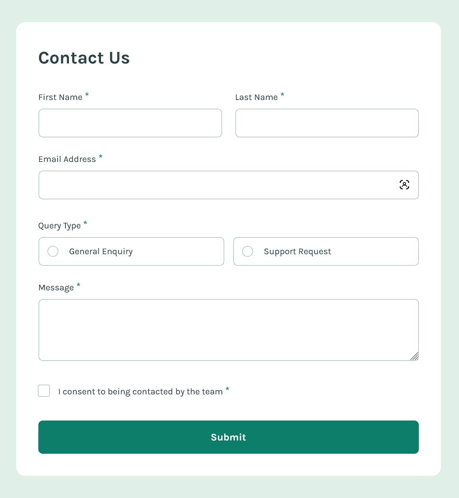
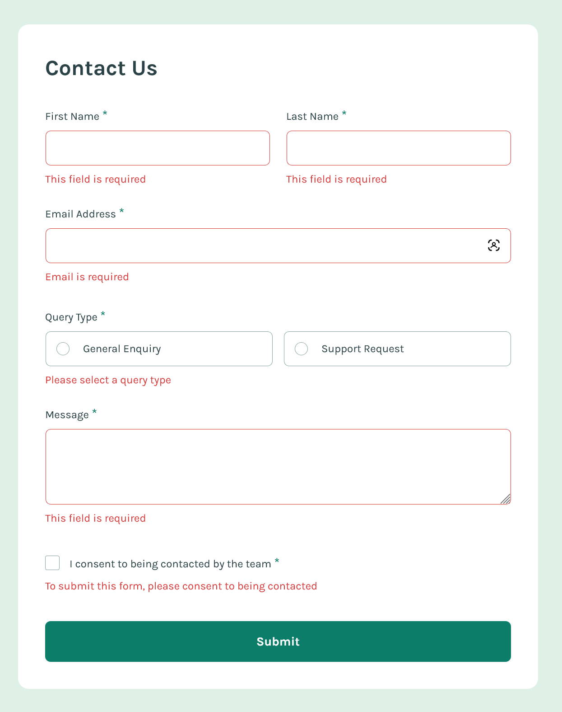

# Frontend Mentor - Contact form solution

This is a solution to the [Contact form challenge on Frontend Mentor](https://www.frontendmentor.io/challenges/contact-form--G-hYlqKJj). Frontend Mentor challenges help you improve your coding skills by building realistic projects. 

## Table of contents

- [Overview](#overview)
  - [The challenge](#the-challenge)
  - [Screenshot](#screenshot)
  - [Links](#links)
- [My process](#my-process)
  - [Built with](#built-with)
  - [What I learned](#what-i-learned)
  - [Continued development](#continued-development)
  - [Useful resources](#useful-resources)
- [Author](#author)

## Overview

### The challenge

Users should be able to:

- Complete the form and see a success toast message upon successful submission
- Receive form validation messages if:
  - A required field has been missed
  - The email address is not formatted correctly
- Complete the form only using their keyboard
- Have inputs, error messages, and the success message announced on their screen reader
- View the optimal layout for the interface depending on their device's screen size
- See hover and focus states for all interactive elements on the page

### Screenshot





### Links

- Solution URL: [Add solution URL here](https://your-solution-url.com)
- [Live site URL](https://singular-kashata-00a5f5.netlify.app/)

## My process

### Built with

- Semantic HTML5 markup
- Accessible design
- Mobile-first workflow
- [Tailwindcss](https://tailwindcss.com/) - CSS framework
- [Vite](https://vite.dev/) - Frontend build tool
- [React](https://reactjs.org/) - JS library


### What I learned

While this is a fairly simple form as forms go, I'm proud of my work here, both in matching the design comp and producing a versatile component structure that I can make small tweaks to in the future. After all, forms are one of the backbones of the web. It seemed well worthwhile to spend a lot of extra time on this project.

This, as Kevin Powell notes in the video linked below, is a deceptively complicated form. In my experience, this was primarily due to the radio input styles and custom error states. This is especially true in a vanilla JavaScript implementation. I used React for my solution, which greatly simplified much of the form's logic while allowing for a good deal of practice with React hooks. The subdued and straightforward design of the form also made Tailwind an easy choice.  

Obviously, this is a one-off design and form, but I tried to approach it as if there could be various types of forms on the site beyond this straightforward Contact Us form, and thus make each component as reusable as seemed reasonable.  To that end, I made liberal use of various props, but also included the `useId` hook to allow for the component to handle reliably creating the unique ID rather than passing another value via a prop. The clsx utility isn't doing much in this particular instance, but I've found it handy in previous small projects and felt like it was a good choice again to handle a conditional Tailwind class here.

```js
import { useId } from "react";
import { clsx } from "clsx";

function Input({
  inputRef,
  label,
  type,
  name,
  autocomplete = "off",
  required = false,
  value,
  onChange,
  error,
  colSpanFull
}) {

  const inputId = useId();
  const errorId = `${inputId}-error`;

  const formGroupClassNames = clsx('grid auto-rows-min space-y-2', {
    'sm:col-span-full': colSpanFull,
  });

  return (
    <div className={formGroupClassNames}>
      <label
        htmlFor={inputId}
        className="text-base after:text-brand-green-600 after:content-['*'] after:ml-1 after:text-xl">
        {label}
        <span className="sr-only">required</span>
      </label>
      <input
        ref={inputRef}
        id={inputId}
        name={name}
        autoComplete={autocomplete}
        required={required}
        type={type}
        value={value}
        onChange={onChange}
        aria-invalid={!!error}
        aria-describedby={error ? errorId : undefined}
        className={`block w-full cursor-pointer rounded-lg bg-white px-4 py-3.5 text-base autofill:bg-white outline-1 -outline-offset-1 focus:outline-2 focus:-outline-offset-2 focus:outline-brand-green-600 hover:outline-2 hover:outline-brand-green-600 ${
          error ? 'outline-brand-alert' : 'outline-brand-grey-500'
        }`}
      />
      {error && (
        <span
          id={errorId}
          className="text-brand-alert col-span-full"
          aria-live="polite">
          {error}
        </span>
      )}
    </div>
  );
}
```

A few things are going on here in the main form submit handler. We call the validate function to handle real-time errors in the form, preventing any submission until all the fields are valid. Since the form isn't wired up to anything on the backend, I left this one last console.log to validate the final information. 

Additionally, since autofill styles tend to persist after form submission (particularly with a password manager like 1Password), I added a key in state for the form, updating it as the last step to force a mount of a fresh form.

I'm sure there are more robust enterprise solutions for that sort of thing, but this seemed the simplest path for this small project.

```js
  function handleSubmit(e) {
    e.preventDefault();

    const newErrors = validate();
    setErrors(newErrors);

    if (Object.keys(newErrors).length > 0) {
      const firstInvalidField = Object.keys(newErrors)[0];
      refs[firstInvalidField]?.current?.focus();
      return;
    }
    console.log("form submitted:", formData);

    e.target.reset();
    
    setFormData({
      firstName: "",
      lastName: "",
      email: "",
      queryType: "",
      message: "",
      consent: false,
    });
    
    setShowModal(true);
    setFormKey((prev) => prev + 1);
  }
```

### Continued development

For such a seemingly straightforward design and functionality, this form was great fun to build out using React and Tailwind and a great opportunity to keep practicing core React concepts like data binding and the use of a variety of hooks. Moving forward, I'm looking forward to learning the various approaches to building fully functional, front-to-back forms in the React ecosystem.

### Useful resources

- [Form styling essentials](https://www.youtube.com/watch?v=nuDpLN2dazU&t=43s) - Another great resource from Kevin Powell on using modern CSS to style a form. I used TailwindCSS for my styling, but this video is still highly instructive on approaching a styling strategy.
- [A deceptively complex form](https://youtu.be/jJgNgNNHqjk) - Yet another Kevin Powell video tutorial where he is actually coding this exact challenge. I found this after I'd started the project and decided I was going to use Tailwind for my styling, so I definitely diverge in some areas. But it was still helpful, particularly in nailing down some of the trickier layout sizing (particularly the textarea input).
- [How to set custom error messages](https://youtu.be/h5qqmE83Tes) - The follow-up to Kevin's project walkthrough above. This one mainly handles building out the custom error messaging the design comp calls for using JavaScript. Since I used React for my solution, much of this isn't relevant to my project, but it's still well worth the watch, especially if you're using vanilla JS for the challenge. However, this video did remind me to implement the feature of returning the focus to the first invalid field after form submission (which I'd neglected to implement before reviewing Kevin's video walkthrough), so that ended up great.
- [Tailwindcss docs](https://tailwindcss.com/docs/hover-focus-and-other-states#has) - The official Tailwind docs have a use case example for the `:has()` selector that is pretty much perfect for styling the radio inputs for this project. There are svg assets for the radio and checkbox selected states, but I opted to style the native inputs as close to the design comp rather than create fully customized visual input states.
- [Frontend Masters Tailwind CSS v2](https://frontendmasters.com/courses/tailwind-css-v2/) - Steve Kinney's latest Tailwind course over at Frontend Masters is excellent. The supplemental course material you get access to is probably worth the cost alone of a month's subscription. In building out my confirmation modal dialog, this content was extremely useful for implementing the Tailwind styles.
- [Pure CSS Custom Checkbox](https://moderncss.dev/pure-css-custom-checkbox-style/) - Though this is primarily a Tailwind implementation, I still found a place for a touch of custom CSS. Stephanie Eckles is a consistently excellent resource for all things CSS and Accessibility. This article walks you through building out an entirely custom checkbox input, which was great for better matching the design comp in this project and producing more consistent styling across browsers. I needed to tweak the styles for a design match and to make them into a partial Tailwind implementation (thanks, ChatGPT), but there's a ton of useful info here and an attached CodePen example.


## Author

- Website - [Matt Pahuta](https://www.mattpahuta.com)
- Frontend Mentor - [@mattpahuta](https://www.frontendmentor.io/profile/MattPahuta)
- Bluesky - [@mattpahuta](https://bsky.app/profile/mattpahuta.bsky.social)
- LinkedIn - [Matt Pahuta](www.linkedin.com/in/mattpahuta)